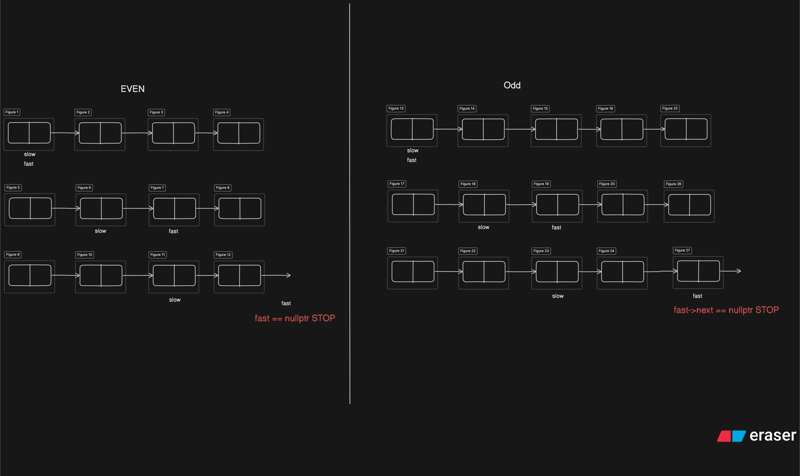

# DSA REVISION

# Step 1: Basics

## Patterns

## Learn STL

## Basic Maths

### 1. Count Digits

#### **UNOPTIMISED APPROACH**

- Create A Counter, ÷ Each Number By 10 and Increase Counter

### 2. Reverse A Number

#### **OPTIMISED APPROACH**

- Take Remainder
- Check if FinalAns > INT_MAX/10 || FinalAns < INT_MIN/10
- Multiply Final Ans by 10 and Add Remainder

### 3. Check Palindrome Number

#### **OPTIMISED APPROACH**

- If Negative Number Then Return False
- First Calculate Reverse
- If Reverse and Original No. Same Then it Is A Palindrome

### 4. GCD or HCF

#### **UNOPTIMISED APPROACH**

- Loop from 1 to min(num1,num2)
- Divide Each Number With min(num1,num2)
- Return the Final Answer

#### **BETTER APPROACH**

- Loop from min(num1,num2) to 1
- Divide Each Number With min(num1,num2) if Found Then Break
- Return the Final Answer

#### **OPTIMISED APPROACH [Euclidean Algorithm]**

- Subtract & Update Lesser Number From Greater Number
- Keep Repeating This Step Till Any One Number is 0
- After any no. is 0 return the other number.

### 5. ArmStrong Number

#### **OPTIMISED APPROACH**

- Initialize Armstrong Sum = 0
- Calculate Remainder and Then Divide By 10
- Add Remainder _ Remainder _ Remainder to Armstrong Sum
- If Armstrong Sum == number, Then it is an Armstrong Number

### 6. Print All Divisors Of Given Number

#### **UNOPTIMISED APPROACH**

- From Number till 1 Add To Set if Number % iterator == 0

#### **OPTIMISED APPROACH**

- Run A For Loop From 1 to <= sqrt(n)
- if n % i == 0, {
  then i is a divisor,
  if(n/i != i){ // Not 6 x 6 =36 i.e it's counter part is different
  then n/i is also a divisor
  }
  }
- 

### 7. Check if Number is Prime

#### **UNOPTIMISED APPROACH**

- Initialize flag = false
- Run a for loop from 2 till < n , If n % iterator == 0 -> flag=true
- if flag is false then it is a prime, otherwise not a prime

#### **OPTIMISED APPROACH**

- Initialize flag = false
- Run a for loop from 2 till < sqrt(n) , If n % iterator == 0 -> flag=true
- if flag is false then it is a prime, otherwise not a prime

## Basic Recursion

### 3. Print 1 To N

#### **APPROACH 1**

- Run Recursion From n and also store current value as 1 solve(1,n)
- each step solve(current + 1, n)
- Base Condition current > n

#### **APPROACH 2 [BACKTRACKING]**

- Run Recursion From n
- After solve(n-1) write the print Statement (BACKTRACKING)
- 

### 5. Sum 1 To N

#### **APPROACH [Recursion]**

- Run Recursion From n and also store current sum as 0 solve(n,sumFirstN)
- Base Condition if(n <= 0)
- While Backtracking return sumFirstN += end

### 7. Reverse An Array

#### **APPROACH 1 [2 Pointer]**

- Run A For Loop
- Using 2 Pointer Technique to swap(arr[i],arr[n-i-1])

#### **APPROACH 2 [RECURSION]**

- Recursion Function Pass Array and iterator=0
- Base Condition iterator >= arr.size()/2
- swap(arr[iterator],arr[size - iterator - 1])

### 8. Check Palindrom String With Other Special Characters

- 

#### **APPROACH [2 Pointer]**

- Initialize 2 Pointers start=0 & end = str.size() - 1
- check if( !isalnum(str[start]) ) then start++
- else if( !isalnum(str[end]) ) then end--
- else if( tolower(str[start]) != tolower(str[end]) ) then return Not Palindrome
- else start++,end--

### 9. Nth Fiboonacci Number

#### **APPROACH**

- Recursion from n
- each recursion return fibo(n-1) + fibo(n-2)

## Hashing

### 1. Count Frequency Of All Elements

#### **UNOPTIMIZED APPROACH**

- Create a visited array of size n
- run a for loop from 0 to < n, if element already visited then continue
- otherwise mark the element visited and initialize count=0 and run another for loop that counts the occurence of element in array
- Print the Count

#### **OPTIMIZED APPROACH**

- Create an unordered_map < int,int > to store each element count
- Run a For loop map[arr[i]]++
- then print the map by map.first and map.second

### 2. Max/Min Frequency Out Of All Elements

#### **OPTIMIZED APPROACH**

- Create an unordered_map < int,int > to store element and its freq
- Run a For Loop to store into map each freq
- initialize min_value,min_element, max_value,max_element
- Iterate Through The Map update min/max value by checking for min()/ max() of it.second and current min or max values, if value updates to current value then update min/max element by iterator.first

# Step 2: Important Sorting Techniques

### 1. Selection Sort [Select Min Element From rest of array & swap]

- 
- Run Outer For Loop Iterating Each Index 0 to n
- Initialize Minimum_Index = i
- Run Inner For Loop i+1 to n
- Select the most min element from rest of array and store it's index in Minimum_Index
- Swap Minimum_Index Element with Current Element

### 2. Bubble Sort [check next element if it is smaller then swap]

- Run For Loop From i=0 to i < n
- Run Inner For Loop from j=0 to j = n - i - 1 [Because we check arr[j] > arr[j+1] Which can Go Out of Bounds]
- if ( arr[j] > arr[j+1] ) then swap( arr[j], arr[j+1] )
- check if swap took place in loop otherwise break because array sorted

### 3. Insertion Sort [For Each Element Put it into its Correct Place On its left]

- 

- Run For Loop From i=0 to i < n
- Run Another Inner Loop From j = i to j > 0
- Check if( arr[j] < arr[j-1] ) then swap them, otherwise break inner loop because array sorted uptil current Element

### 4. Merge Sort [Divide & Conquer (Divide Search Space then recombine in sorted manner)]

- 

- Create 2 Functions merge_sort() and merge()
- in merge_sort Call merge_sort from low to mid & mid+1 to high
- After call merge function
- In merge() create a temporary array & initialize left = low, right = mid+1
- create a while loop (left<=mid && right <= high )
- create inner while loops which will insert the minimum of arr[left],arr[right] to temporary array
- After Insert Remaining of left <= mid or right <= high
- Create a For Loop to replace original array elements with sorted temporary elements

### 5. Quick Sort [Divide & Conquer ( Pick A Pivot Element & Swap it by counting elements <= pivotElement )]

- Create a quick sort function which has another partition function
- After partition call quickSort(arr,low,partition-1), quickSort(arr,partition+1,high)
- partition(arr,low,high) function SWAPS the first element of current subarray with the number of elements <= arr[low]
- initialize left = low,right =high
- Create a while loop (left < pivotIndex && right > pivotIndex)
- Create Inner While Loops where left < pivotElement then left++
- Create Inner While Loops where right > pivotElement then right--
- Again Check if left < pivotIndex && right > pivotIndex , then swap( arr[left++],arr[right--])
- return pivotIndex

# Step 3. Arrays

## **EASY**

### 1. Largest Element In An Array

**APPROACH**

- Initialize a maxi = INT_MIN variable
- Compare each element in array and store maximum element maxi = max(maxi,arr[i])

### 2. Second Largest/Smallest Element In An Array

**UNOPTIMIZED APPROACH**

- Sort the Array
- Second Index -> 2nd Smallest, Last Second Index -> 2nd Largest

**OPTIMIZED APPROACH [EDGE CASE]**

- initialize smallest,second_smallest,largest,second_largest
- Run A Loop From 0 to n
- if arr[i] > largest, then store largest in second_largest & update largest = arr[i]
- **EDGE CASE [Beacause Largest can be the first element]** else if arr[i] < largest && arr[i] > second_largest, update second_largest = arr[i]
- if arr[i] < smallest , then store smallest in second_smallest & update smallest = arr[i]
- **EDGE CASE [Beacause Smallest can be the first element]** else if arr[i] > smallest && arr[i] < second_smallest, then update second_smallest = arr[i]
- return second_largest & second_smallest

### 3. Check Is Array Sorted

**OPTIMIZED APPROACH**

- Run A Loop from 0 to n
- if at any point (currentElement > nextElement) return false
- otherwise return true

### 4. Remove Duplicate Elements From Sorted Array [inplace, print first k elements which are non duplicated]

**UNOPTIMIZED APPROACH**

- Create A Set And set.insert(arr[i]) all elements
- Initialize (i=0) & iterate through the set and set arr[i++] = iterator_set

**OPTIMIZED APPROACH**

- Initialize current Index = 0
- Run a Loop From iterator=1 to n
- if {_DUPLICATE ENCOUNTERED_} arr[iterator] == arr[currentIndex], then continue
- otherwise (_Not Duplicate Encountered_) increase currentIndex += 1 & store arr[currentIndex] = arr[iterator]
- print Array of removed duplicates from 0 to <= currentIndex

### 5. Left Rotate Array By 1 Place

**APPROACH 1**

- 
- Store the First Element
- From i=0 to i < n-1 ,store arr[i] = arr[i+1]
- assign last element arr[n-1] = firstElement

**APPROACH 2 [STL]**

- Store First Element
- Erase first element
- push_back first element

### 6. Left/Right Rotate Array By K Place

**UNOPTIMIZED APPROACH**

- if rotate by left
- store first k elements in temp array
- erase first k elements
- push_back first K elements back to array

- if rotate by right
- store last k elements in temp array
- erase last k elements
- .insert temp elements back to array

**OPTIMIZED APPROACH [REVERSE ALGORITHM]**

- create a reverse function
- if rotate by left
- reverse first k elements
- reverse rest of elements
- reverse all elements

- if rotate by right
- reverse last k elements
- reverse rest of elements
- reverse all elements

### 7. Move All Zeroes To End

**OPTIMIZED APPROACH 1**

- count all zeroes
- erase all zeroes
- push_back zeroes count times

**OPTIMIZED APPROACH 2 [TRICKY]**

- 
- Create 2 Pointers
- ptrZero points to First Occurence 0
- ptrNonZero points to NON 0 element (_Just After ptrZero pointer_)
- if (arr[i] != 0) then swap the ptrZero and ptrNonZero & move ptrZero++ because now it points to just next zero

### 8. Join 2 Sorted Arrays while removing duplicates

**UNOPTIMIZED APPROACH**

- create an Ordered Set
- insert into set values of array1 and array2
- traverse set and push_back into ans array

**OPTIMIZED APPROACH**

- create 2 pointer to keep track each array element
- whichever ptr element is lower && is not equal to ans.back() element will be added
- Enter All Remaining Elements of either Array1 OR Array2 && they should != ans.back()

### 9. Missing Number In Array [*Duplicate Try to Use XOR*]

**UNOPTIMIZED APPROACH**

- for each element check if the element exists in entire array if not then found the missing number

**BETTER APPROACH**

- Create an unordered set insert each element in it
- again traverse through array and .find() each element if iterator == set.end() then found the missing element

**OPTIMIZED APPROACH 1**

- Calculate sumN from 1 to n => (N \* (N + 1))/ 2
- calculate sum of array
- Missing Number = sumN - sum of Array

**OPTIMIZED APPROACH 2**

- Calculate XOR of 1 to N
- Calculate XOR of Array
- Calculate XOR of 1 To n ^ XOR of Array [ XOR Of Same No. Will be 0 & XOR of 0 with a number returns Number itself] gives missing number
- EXAMPLE:
- XORN : 1 ^ 2 ^ 3 ^ 4 ^ 5 ^ 6 ^ 7 ^ 8 ^ 9 ^ 10 ^ 11
- XORArray: 1 ^ 2 ^ 3 ^ 4 ^ 5 ^ 6 ^ 8 ^ 9 ^ 10 ^ 11
- RESULT : 0 ^ 0 ^ 0 ^ 0 ^ 0 ^ 0 ^ 7 ^ 0 ^ 0 ^ 0 ^ 0 => 7

### 10. Max Count of 1's in array of only 0 & 1

**OPTIMIZED APPROACH**

- Keep track of current count of 1 and maximum count of 1
- if 0 is encountered reset current count

### 11. Find Number Appearing Once With Array of elements occuring twice [*Duplicate Try To Use XOR*]

**UNOPTIMIZED APPROACH**

- Create a Unordered HashMap store every element frequency
- return element with frequecy as 1

**OPTIMIZED APPROACH**

- Find XOR Of All Elements
- {_Same Elements XOR will be 0 & finally XOR with 0 returns number itself_}
- return XOR

[ **PREFIX SUM** ]

### **_HINT_ -> SUBARRAY THINK OF PREFIX SUM with MAP**

### 12. Length of Longest Subarray [ **CONTIGOUS** ] with sum K (POSITIVES ONLY)

**UNOPTIMIZED APPROACH**

- for each element check its subarray (contigous) calculate if sum equal to K then store max length by inner loop index - outer loop index

**BETTER APPROACH [PREFIX SUM]**

- Track current sum of array & max Size
- if sum == k , then update max size
- if sum - k found in map then update max size
- Store every sum along with their index in unordered_map if not already present

**OPTIMIZED APPROACH**

- Initialize 2 pointers (left,right)
- store first element in sum
- when sum > k subtract current element from sum
- if sum == k store current length
- if right < n then add element in sum

### 13. Length of Longest Subarray [ **CONTIGOUS** ] with sum K (POSITIVES & NEGATIVES) [*PREFIX SUM*]

**UNOPTIMIZED APPROACH**

- for each element check its subarray (contigous) calculate if sum equal to K then store max length by inner loop index - outer loop index

**OPTIMIZED APPROACH [PREFIX SUM]**

- Track current sum of array & max Size
- if sum == k , then update max size
- if sum - k found in map then update max size
- Store every sum along with their index in unordered_map if not already present

## **MEDIUM**

### 1. 2 Sum [**1 pass sum think of hashmap**]

#### **UNOPTIMIZED APPROACH**

- take 2 loops check each combo if sum == target then print yes and indexes

#### **OPTIMIZED APPROACH 1**

- **FORMULA: Target - arr[i]**
- Store Each Element in unordered_map
- check if target - currentElement present in map, if present then return yes & currentElement, {target-currentElement}

#### **OPTIMIZED APPROACH 2 [GREEDY]**

- Sort the Array
- Take 2 Pointer Beginning and end
- if begin + end < target then begin++ otherwise end++

### 2. Sort Array of 0, 1 ,2

#### **UNOPTIMIZED APPROACH**

- Sort The Array Using Sorting Algorithm

#### **BETTER APPROACH**

- count no. of 0, 1, 2 and then populate them back into the array

#### **OPTIMIZED APPROACH [ *DUTCH FLAG ALGORITHM* ]**

- 3 Pointer Approach ( low, mid, high )
- if element at mid == 0, then swap low and mid and low++, mid++
- if element at mid == 1, then mid++
- if element at mid == 2, then swap mid and high, and high--

### 3. Majority Element ( > n/2)

#### **UNOPTIMIZED APPROACH**

- for each element traverse array again and count number of occurernces & store the max count

#### **BETTER APPROACH**

- Store Each frequency of element in HASHMAP
- Return the Maximum Frequency Element

#### **OPTIMIZED APPROACH [*Moore's Voting Algorithm*]**

- store majortyElement and Count
- check if element same as majority element with count > 0, then increase count
- if count == 0 , then update majorityElement and increase count

### 4. Kadane Algorithm [Maximum Subarray Sum]

#### **UNOPTIMIZED APPROACH**

- Take 2 loops check each and every subarray sum and store the sum, and start index and end index array to print maximum subarray sum

#### **OPTIMIZED APPROACH [ *KADANE* ]**

- Just DO **sum += arr[i]**
- Keep track of current sum
- store maximum sum & if sum < 0, then sum = 0
- temporary starting index will update to current Index whenever currentSum == 0
- Also For Array start & end index -> _whenever max sum updated_ then update end Index & actual start Index with temporary starting index

### 5. Stock Buy & Sell [ Buy Early Sell Later ]

#### **UNOPTIMIZED APPROACH**

- Calcuate each and every profit
- store max Profit

#### **OPTIMIZED APPROACH**

- Store Minimum Element and store maximum profit as difference between currentElement and MinElement

### 6. Alternate Positive & Negative Element in Array [start positive]

#### **OPTIMIZED APPROACH**

- Create answer array
- put all positive element in even places & negative elements in odd places
- if either negative or positive have exhausted
- insert remaining positive or negative [only 1 type remains if excess]

### 7. Next Permutation ( Time Complexity To Generate All Permutation -> N! )

#### **UNOPTIMIZED APPROACH**

- generate all permutations
- search for current permutation & print the next element
- EDGE: if it is the last element return the first element otherwise return the

##### _GENERATING ALL PERMUTATIONS [swap indexes] TC-> O( N! x N )_

- Using **Recurion** & **Backtracking**
- for each index loop till rest of array
- swap index with iterator
- Call recursive function with index + 1
- BACKTRACK: swap back the iterator with index

#### **STL APPROACH**

- Use _next_permutation()_

#### **OPTIMIZED APPROACH [ Break Point ]**

- 

- Longest Prefix Match arr[i] < arr[i+1] --> This is the BREAK Point _{ Check From Right }_
- Select greater than current element arr[i] but the smallest one from after the break line i.e i+1 & greater index
- if no index found then reverse entire array
- if index found then from right just greater element swap with arr[i]
- reverse array after break point

### 8. Leaders In Array

#### **UNOPTIMIZED APPROACH**

- For Each Element Check if It is Maximum

#### **OPTIMIZED APPROACH**

- From right carry the maximum element
- if currentElement > maximumElement then store currentElement into Leaders array

### 9. Longest Consecutive Subsequence

#### **UNOPTIMIZED APPROACH**

- For Each Element check if element+1, element+2,...element+arr.size() are present
- if not present then break and store highest length

#### **BETTER APPROACH**

- Sort The Array
- check next element same if not then set current length = 0 & store max length

#### OPTIMIZED APPROACH _[ SET ]_

- **[Consecutive -> Must be 1st Element of the sequence for OPTIMIZATION]**
- Using Set Data Structure Store All elements
- Check if _element-1 exists, then continue_ as it can't be starting of longest subsequence
- otherwise element-1 not exist, then search element+1,element+2,....,element+arr.size() & store the maximum length

### 10. Set Matrix Zero

#### **UNOPTIMIZED APPROACH**

- whenever 0 encountered make entire row and column -1 except 0 elements
- Again traverse and replace -1 with 0

#### **BETTER APPROACH [SC ↑]**

- Maintain Two Array for Row and Col
- if 0 encountered mark index of Row and Col to be true
- traverse wherever row or col 0 encountered make entire row & col 0

#### **OPTIMIZED APPROACH**

- **EDGE CASE:** Keep track of 0 in row0 and col0 seperately
- Mark in first Row All the columns having 0 & in first Col mark for each row having 0
- {Suppose 1st Col has 0 if we depend upon 1st col for row 1 then row 1 also become all zero}
- Again traverse from 1st index as we don't want to change either row or col
- if anywhere in row0 or col0 element 0 is found make entire row or col 0
- finally check if row0 or col0 is true then make them entire 0

### 11. Rotate Matrix 90 Degree

#### **UNOPTIMIZED APPROACH**

- Take Another Answer array for each row make each col of ans array from last same

#### **OPTIMIZED APPROACH**

- Transpose Matrix
- then reverse each row

### 12. Print Matrix Spiral

- _GO LAYER BY LAYER_
- take 4 variables startRow = 0, endRow = n-1, startCol = 0, endCol = n-1
- print startCol -> endCol each element of startRow, then startRow++
- print startRow -> endRow each element of endCol, then endCol--
- print endCol -> startCol each element of endRow, then endRow--
- print endRow -> startRow each element of startCol, then startCol++

### 13. Count Subarray Sum Equal To K

#### **UNOPTIMIZED APPROACH**

- Calculate each and every subarray and if subarray sum == k increase the count

**BETTER APPROACH [PREFIX SUM]**

- 
- Track current sum of array & store sum & its index in map or set
- if sum == k , then increase count
- if sum - k found in map or set then update count
- Store every sum along with their index in unordered_map if not already present

**OPTIMIZED APPROACH**

- Initialize 2 pointers (left,right)
- right adds each and every element
- while left <= right & at any time current Sum > k then remove arr[left] from sum
- if sum == k ,then increase the count
- increase right & check if < arr.size() , then add next element to sum

## **HARD**

### 1. Pascal Triangle

- 
- 

#### _VARIATION 1_

- _Given Row & Col Index Give Element At Pascal Triangle (row,col) position_
- use formula row-1 C col-1
- nCr -> n! / (r! \* (n-r)!)

#### _VARIATION 2_

- Same as variaion 1 just go for entire col same as length of row keep row same

#### _VARIATION 3_

- add another loop to manage row as well & make col go from 0 < loop1 + 1

### 2. Majority Element Array _[ > N ÷ 3 ]_

- _There Can be Only 2 Elements >N/3_

#### **UNOPTIMIZED APPROACH**

- Check For each & every Element if greater than N/3, then add to answer array

#### **BETTER APPROACH**

- Keep Track of Frequency Of All Elements in Unordered_map if frequency > N/3, then store element in Answer

#### **OPTIMIZED APPROACH _[Extended Morre's Voting Algorithm]_**

- 
- Create 4 Pointers _{2 for tracking element count & 2 for storing max element}_
- if Count == 0 && currentElement != otherElement ,then reset count=1 & UPDATE element stored to current Element
- **_EDGE CASE:_** When checking for an element make sure current element != other stored element
- if current element same as stored element increase count
- if current Element not equal to stored element decrease count
- After Looping through array Again calculate respective count of both the element
- if count > N/3 then store it in answer

### 3. 3 Sum Equal to target

#### **UNOPTIMIZED APPROACH**

- _set<vector<int>> to vector<vector<int>>_
- Run 3 Loops 0 to n-1, i+1 to n-1, j+1 to n-1
- if sum == target store the triplet in **IMPORTANT:** SORTED MANNER {To Check Existence of same triplets} otherwise their order might be different and we could add same triplets

#### **BETTER APPROACH _[2 Pointer Approach With 3rd Element as Lookup]_**

- **_FORMULA: Target - (arr[i]+arr[j]+arr[k])_**
- traverse each element
- Declare another hashset to store 2nd element
- run another loop from i+1 to n
- check if 3rd Element = target - (arr[i] + arr[j]) is Present in set of visited elements
- if visited then store triplet
- at last transfer set< vector< int >> to vector< vector< int >>
- **_ORDERED SET SHOULD BE USED Only it can store set<vector<int>>_**

#### **OPTIMIZED APPROACH**

- Sort the array
- take 3 pointers i=0,j=i+1,k=n-1
- skip duplicates of ith pointer
- if sum > target => k--
- if sum < target => j++
- **_EDGE CASE: Ensure Duplicates Removed_**
- if sum == target => Store Triplet & keep increasing and decreasing 2nd and 3rd pointer to avoid duplicates

### 4. 4 Sum Equal to target

#### **UNOPTIMIZED APPROACH**

- Take 4 Loops And Calculate sum whether equal to target, if equal then sort and store it in set of vectors

#### **BETTER APPROACH [Loop + Loop + Set{For Lookup} + Loop]**

- **_FORMULA: 4th Element = target - (arr[i]+arr[j]+arr[k])_**
- Take 3 Loops
- first loop iterate each element
- second loop iterate i+1 to n-1
- before 3rd Loop create a set for visited elements
- 3rd loop have **_4th Element = target - (arr[i]+arr[j]+arr[k])_** if present in set then we found the 4 numbers equating to sum target now sort and add them to set

#### **OPTIMIZED APPROACH [Loop + Loop + Set{For Lookup} + 2 Pointer]**

- Sort the array
- Take 4 Pointer (2 Fixed, 2 moving)
- 2 Moving 1->start, 1->end
- **_IMPORTANT: Check Duplicate at every loop_**
- if sum == target => store answer and move forward/back till no longer duplicate
- sum < target => pointer3++
- sum > target => pointer4--

### 5. Longest Subarray With Sum 0

#### **UNOPTIMIZED APPROACH**

- Check Each and Every Subarray Sum == 0, then store longest length

#### **OPTIMIZED APPROACH [Use HashMap Only]**

- Calculate Prefix sum
- for each element check whether currentSum - target is present or not
- if present store maxLength
- Store sum in unordered_map along with index

### 6. Count Subarrays with XOR Target

#### **UNOPTIMIZED APPROACH**

- Calculate XOR of Each and every subarray & if XOR == Target, then count++

#### **OPTIMIZED APPROACH**

- **_EDGE CASE:_** Do map[0]++, Because if first element is equal to xor of target then we find xor ^ target which will be 0 and it isn't included in map yet
- Store Xor in Prefix Xor, then store in hashmap
- for each element check XOR ^ CurrentXOR if Present in Hashmap then increase the count, otherwise insert current XOR in Hashmap

### 7. Merge Overlapping Subintervals

#### **UNOPTIMIZED APPROACH**

- SORT the Array
- store start & end of interval
- **_EDGE CASE:_** if end <= ans.back()[1] which means it has already been merged so continue
- check from i+1 < n whether start <= currentElement[0] if true then update end
- else break
- push_back start & end in ans

#### **OPTIMIZED APPROACH**

- SORT the Array
- push_back first element in answer
- in a single pass we will check
- **_CASE 1:_** if current element's start <= end of ans.back() then update answer's end to max(currentElement's end, ansElement's end )
- **_CASE 2:_** otherwise store the entire interval in answer

### 8. Merge 2 Sorted Arrays

#### **UNOPTIMIZED APPROAACH**

- Take 2 Pointers in start of both arrays whichever smaller push to answer array

#### **OPTIMIZED APPROACH 1**

- [Picking up greater elements of array1 & swapping to arr2 until they become equal or greate so that all larger elements go into arr2]
- Take 2 pointers 1 in end of 1st array in start of 2nd array
- if element at ptr1 > ptr2 then swap arr1[ptr1--] & arr2[ptr2++]
- if element at ptr1 <= ptr2 then break
- Individually sort arr1 & arr2

### 9. Find Repeating and missing number

#### **UNOPTIMIZED APPROAACH**

- Run Loop From 1 to n , initialize count = 0, run through entire array
- if count == 0 -> missing number, count == 2 -> repeating number

#### **BETTER APPROACH**

- create a unordered hashmap and store from 1 to n natural numbers with frequency = 0
- store frequency of each and every element of array
- traverse through map and if any freq == 0 -> missing number, freq == 2 -> repeating number

#### **OPTIMIZED APPROACH [MATHS EQUATION]**

- 

### 10. Count Inversions in array [Merge Sort]

#### **UNOPTIMIZED APPROACH**

- for each and every element if arr[i] > arr[j] then increase the count

#### **OPTIMIZED APPROACH [MERGE SORT]**

- 
- Assume 2 Sorted Array Approach [Merge Sort]
- maintain count while applying merge sort in merge function
- while(arr[left]>arr[right]) then increase count by += (mid - left + 1) because all elements are sorted in both arrays and all left after that point will be greater than right so add their count

### 11. Count Reverse Pairs in array [Merge Sort]

#### **UNOPTIMIZED APPROACH**

- for each and every element if arr[i] > 2\*arr[j] then increase the count

#### **OPTIMIZED APPROACH [MERGE SORT]**

- Using merge sort maintain the count
- Just Before Merging call count_pairs()
- It moves through left sorted array and check whether element in right sorted array is arr[left] > 2 \* arr[right]
- if so then increase count += (right - (mid+1)) **_[Here Move Through All Left even if right comes to end]_** here we don't add + 1 in (right - (mid + 1) **+1**) because right is at position which is fails condition arr[left] > 2\*arr[right]

### 12. Max Product Subarray

#### **UNOPTIMIZED APPROACH**

- For Each & Every Subarray Calculate product and store the maximum product

#### **OPTIMIZED APPROACH 1**

- **_{why prefix & sum Important? otherwise EDGE Case [2,3,-2,4,3] max Product will be 12 but it will give 6}_**
- initialize 2 pointers pre = 1 & suffix = 1
- start pre from 0 & suffix from end n-i-1
- **ZERO ENCOUNTERED:** at any point if(pre == 0) then set pre = 1 ,or suff == 0 then set suffix = 0
- otherwise calculate currentProduct and store max of pre,suffix,ans

#### **[ DON'T Do In Interview NON INTUITIVE ]OPTIMIZED APPROACH 2 [Kadane Modified]**

- _Main Idea of This is we can get max product from -ve elements product as well_
- Maintain prod1 and prod2
- prod1 will be max of currentElement\*prod1,currentElement,currentElement\*prod2
- prod2 will be min of currentElement\*prod1,currentElement,currentElement\*prod2
- return max of prod1 and prod2

# Step 4. Binary Search [SORTED O(logn)]

- **_Try & Make Some pattern to eliminate a half_**

## Binary Search On 1D Array

### **_FORMULA: start + (end - mid)/2_**

### 1. Search Element In Sorted Array w/o Duplicates

- Use Binary Search

### 2. Implement Lower Bound (Atleast Target Element or greater)

#### **UNOPTIMIZED APPROACH**

- Use Linear Search To find the first element in sorted array which satisfy the condition arr[i] >= target, return the index

#### **OPTIMIZED APPROACH**

- Use Binary Search
- **_Case 1:_** arr[mid] >= target , we can go into left half
- **_Case 2:_** arr[mid] < target, then only go in right half

### 3. Implement Upper Bound (Atmost Target Element or smaller)

#### **UNOPTIMIZED APPROACH**

- Use Linear Search To find the index where currentElement > target and return the previous index as answer & break

#### **OPTIMIZED APPROACH**

- Using Binary Search
- **_CASE 1:_** arr[mid] <= target, store current element in answer and traverse in right half
- **_CASE 2:_** arr[mid] > target, go into left half

### 4. Search Insert Position

#### **OPTIMIZED APPROACH**

- Use Binary Search (Use Lower Bound: Find Either target or just greater element where it will)
- **_EDGE CASE:_** Initialize answer with arr.size() , if all elements smaller then return array size
- **_CASE 1:_** If arr[mid] <= target store in ans = mid & start = mid+1
- **_CASE 2:_** arr[mid] > target, end = mid - 1

### 5. Find Floor & Ceil Value of a given Target

#### **OPTIMIZED APPROACH**

- Use Binary Search
- Use Lower Bound (atleast element or greater) => ceil
- Use Upper Bound (atmost element or smaller) => floor

### 6. Find First And Last Occurence Of Element In Array

#### **UNOPTIMIZED APPROACH**

- For First Occurence -> Start Loop from 0 and reach till target, if not found return -1
- For Last Occurence -> Start Loop from size-1 and reach till target, if not found return -1

#### **OPTIMIZED APPROACH**

- Use Binary Search And For First Occurence in arr[mid] == target, store index and then update end = mid - 1 to go into left half more to find first occurence
- Use Binary Search And For Last Occurence in arr[mid] == target, store index and then update start = mid + 1 to go into right half more to find last occurence

### 7. Count Duplicates Of Target In Array

#### **UNOPTIMIZED APPROACH**

- Initialize counter and whenever currentElement == target, increase counter++

#### **OPTIMIZED APPROACH**

- Find First Occurence, Last Occurence
- Duplicates: Last Occurence - First Occurrence + 1

### 8. Search In Rotated Sorted Array W/O Duplicates

#### **UNOPTIMIZED APPROACH**

- Do A Linear Search And Find The Element

#### **OPTIMIZED APPROACH**

- 
- Do A Binary Search
- if arr[mid] == target return mid
- **_CASE 1:_** Check if arr[start] <= arr[mid], then
- element in left sorted part: if arr[start] <= target && target <= arr[mid], then element in left sorted array end = mid-1
- else(WE ASSUMED WRONG) start = mid+1, element in right half
- **_CASE 2:_** if arr[mid]<=target && target <= arr[end], then element in right sorted array start = mid+1
- else(WE ASSUMED WRONG) end = mid-1, element in left half

### 9. Search In Rotated Sorted Array With Duplicates

#### **UNOPTIMIZED APPROACH**

- Do A Linear Search And Find The Element

#### **OPTIMIZED APPROACH**

- Same as 8. Search in Rotated Sorted Array W/O Duplicates
- **_EDGE CASE:_** If arr[low] = arr[mid] = arr[high], then increment low & decrement high

### 10. Search Minimum In Rotated Sorted Array

#### **UNOPTIMIZED APPROACH**

- Do A Linear Search And Find The Smallest Element

#### **OPTIMIZED APPROACH**

- Do Binary Search Same as rotated sorted array
- Look into sorted half whose arr[start] <= arr[mid] or the right half store the start of sorted half as minimum and then discard the sorted half
- {Choose Leftmost element of Sorted Half And Then Look into other half}

### 11. Number Of Times Array Rotated

#### **UNOPTIMIZED APPROACH**

- Do A Linear Search, Return index where currentElement > nextElement

#### **OPTIMIZED APPROACH**

- Do Binary Search Same as rotated sorted array
- Find Minimum element in rotated sorted array by storing left most of sorted half as minimum and then discarding the sorted half

### 12. Search Single Element in Array Of Duplicates

#### **UNOPTIMIZED APPROACH 1**

- Do A Linear Search, Return index where currentElement != previousElement && currentElement != nextElement

#### **UNOPTIMIZED APPROACH 2**

- XOR Every Element { Same Element ^ Same Element = 0, 0 ^ Different Element } and we will get the Single Element

#### **UNOPTIMIZED APPROACH 3**

- Hashmap of frequency & whenever frequency == 1 return that element

#### **OPTIMIZED APPROACH [Even/Odd Index]**

- 
- Do Binary Search
- Even-Odd Pair {Left Half LEFT->EVEN,RIGHT->ODD}
- Check Mid Left and Right Element if they both are not equal then mid answer
- **_EDGE CASE: _** If Single Element, First Element != Second Element, Last Element != Second Last Element
- For Left Half being normal & not containing single element either mid%2 == 0,then arr[mid+1] should same OR mid%2 == 1, then arr[mid-1] should be same to arr[mid], --> DISCARD CURRENT HALF
- Otherwise Ans will be in left half

### 13. Find Peak Element

#### **UNOPTIMIZED APPROACH**

- For Each Element check whether arr[i-1]< arr[i] && arr[i] > arr[i+1], if so then return arr[i] as peak element

#### **OPTIMIZED APPROACH**

- **_EDGE CASE:_** If size == 1, first element > secondElement or lastElement > prevElement
- start = 1, end = size-2
- if arr[mid] > arr[mid+1] && arr[mid] > arr[mid-1], return arr[mid]
- if arr[mid-1] < arr[mid] && arr[mid] < arr[mid+1] --> INCREASING ORDER No Peak Left Half, move to right
- else search for peak in left half

## Binary Search On Answers [HARD]

### Minimize the max OR Maximize the min

### 1. Find SQRT Of Number

#### **UNOPTIMIZED APPROACH**

- From 1 To N Square Each Number, store in ans if i\*i <= number
- if i\*i > number break

#### **OPTIMIZED APPROACH [sqrt()]**

- Use Built In Function sqrt()

#### **OPTIMIZED APPROACH 2**

- Assume Search Space from 1 to n
- if mid \* mid <= n store in answer
- otherwise move to respective half

### 2. Find Nth Root Of Number

#### **UNOPTIMIZED APPROACH**

- **_exponential power base :_** method Base, Power ---> while(pow > 0) if(Pow % 2==1) then Pow-- ; ans = ans \* Base; else Pow /=2; Base \*= Base
- For Each Number from 1 upto number if i _ i _ i………\* i ( N times ), then break and return the answer

#### **OPTIMIZED APPROACH**

- Do Binary Search From 1 to Number
- if mid \* mid \*....mid (N times) == Number at N times then store and return the answer otherwise -1

### 3. Koko Eating Banana [Minimum K to consume within H Hours]

- **_BINARY SEARCH ON ANSWER SPACE_**
- **Can't move further till current pile not completed so use this formula**
- **_FORMULA :_** Time Req = ceil((double)arr[i]/(double)bananaPerHor)
- **_EDGE CASE:_** double required otherwise give less answer

#### **UNOPTIMIZED APPROACH**

- From 1 to MaxElement in Array
- calculate time required for each iteration
- if timeReqd <= H , then return iteration

#### **OPTIMIZED APPROACH [BINARY SEARCH]**

- Do Binary Search From 1 to MaxElement, find mid
- if timeReqd by mid <= H, then store mid and end = mid-1
- otherwise start = mid+1

### 4. Minimum Days To Make M Bouquets

#### **UNOPTIMIZED APPROACH**

- Traverse From Min Element to Max Element {because atleast min Element Days Required for 1st flower to bloom}
- for each element traverse through entire array
- if arr[j] <= i then increase the count
- otherwise store BouquetsFormed += count / k & Reset Counter
- Now check if BouquetsFormed >= M

#### **OPTIMIZED APPROACH**

- Same As Unoptimized approach just use BINARY SEARCH and calculate mid
- if BouquetCount >= M, then store ans & end = mid-1
- else start = mid+1

### 5. Minimum Divisor Sum With Threshold K

#### **UNOPTIMIZED APPROACH**

- Traverse From 1 to Max Element
- for each element as divisor traverse through entire array
- calculate sum = ceil((double)arr[i]/(double)divisor)
- return if sum <= threshold

#### **OPTIMIZED APPROACH**

- Same as unoptimized approach just use binary search to look for divisor from 1 to maxElement

### 6. Minimum Ship Capacity to ship with D Days [Order Maintained unlike koko eating banana]

- 

#### **UNOPTIMIZED APPROACH**

- Traverse From Max Element to Sum of Array --> Gets package capacity {because at max every Package can be deliverd in 1 day which will be sum of all packages}
- initialize with day 1 and till the currentLoad doesn't cross the Capacity keep on increasing the currentLoad
- if currentLoad > capacity, then day++ and set currentLoad to currentPackage
- After Loop if day <= dayTarget then return answer

#### **OPTIMIZED APPROACH**

- Same as unoptimized approach just use binary search to look for days from maxElement to sum of all Elements

### 7. Kth Missing Number Sorted Array [NON INTUITIVE]

#### **UNOPTIMIZED APPROACH**

- given k
- **_FORMULA:_** if arr[i] <= k, then k++, otherwise return k
- [WHY K++ ?] As if any element comes which is smaller than k takes 1 place so increase k++

#### **OPTIMIZED APPROACH**

- **_FORMULA:_** K + high + 1 { arr[high] + (K - (arr[high]- (high + 1))) --> Current Element + ( K - Missing Number ) }
- Apply Binary search from 1 to max(arr[])
- For mid, the missingNumbers = arr[mid] - (mid + 1)
- if missingNumber == k, then return k
- if missingNumbers < k, then start = mid+1
- else end = mid - 1
- After Completion end will come before start
- **_EDGE CASE 1:_** if(high <= -1) return k
<!-- - **_EDGE CASE 2:_** if(high >= arr.size()) return (arr[low] - (low+1)) + K -->
- return K + high + 1
- 
- 

### 8. Aggressive Cows

#### **UNOPTIMIZED APPROACH**

- SORT ARRAY
- from distance 1 to maxDistance - minDistance
- Allocate First Cow to First Stall, now check for rest of stalls if currentStall - last Allocated stall >= allowedDistance(Taken by loop) then allocate stall and increase cow count
- return previous distance if cowCounted < cowsGiven
- otherwise return max - min

#### **OPTIMIZED APPROACH**

- Same As Unoptimized approach just apply binary search on Limit distance

### 9. Book Allocation

#### **UNOPTIMIZED APPROACH**

- from maxElement to SumElements
- if Sum till current Pg > pages(Taken By Loop) then increase student count and reset SumTillCurrentPg to currentElement
- otherwise increase SumTillCurrentPg count
- if studentCount == studentGiven return pages, else return maxElement

#### **OPTIMIZED APPROACH**

- Same As Unoptimized approach but apply binary search on pages
- return low as answer

### 10. Split Array: Largest Sum

- _Minimized Largest Sum -> Binary Search [Reason For Binary Search]_

#### **UNOPTIMIZED APPROACH**

- from maxElement to SumArr (range decide because atleast max element should be there and at max there could be sum of all elements)
- whenever sum > limit (Decide By Loop) then increase subarray count and reset sum to current element
- if countSubarray == givenCountSubarray, return limit

#### **OPTIMIZED APPROACH**

- 
- **_CONCEPT EDGE CASE:_** After Getting Answer Minimize it so put answer variable in <=
- Same As Unoptimized approach but apply binary search on range of sum
- return mid as answer

### 11. Painter's Partition

- Same as [ 10. Split Array: Largest Sum ]

- 

### 12. Minimize Max Distance Between Gas Stations

- _Minimized Max Distance -> Binary Search [Reason For Binary Search]_
- 

#### **UNOPTIMIZED APPROACH**

- INSERT GAS STATION WHERE MAX DISTANCE BETWEEN 2 POINTS, then maintain count in how many placed
- use formula arr[i+1]-arr[i] / gasStations[i] + 1

#### **BETTER APPROACH**

- Same as unoptimized approach just use MAX HEAP To Find Max Element

#### **OPTIMIZED APPROACH [Very Tough]**

- **_BINARY SEARCH DECIMAL_**
- from 0 to max(distance)
- run loop 1 to n, numberInBetween = arr[i] - arr[i-1] / currentDistance
- if numberInBetween == arr[i]-arr[i-1] / currentDistance, then numberInBetween--
- increase count += numberInBetween
- out of loop if count > k then high = mid otherwise low = mid

### 13. Median Of 2 Sorted Arrays

#### **UNOPTIMIZED APPROACH**

- Merge 2 arrays by taking extra space and if even size return
  ((n1 + n2)/2 + (n1+n2/2 + 1)) / 2 otherwise return (n1+n2)/2

#### **BETTER APPROACH**

- Maintain a count variable and whenever count reaches (n1+n2)/2 or (n1+n2)/2 + 1 store those elements and return if even avg(element1,element2) otherwise return element1

#### **OPTIMIZED APPROACH [Binary Search Partition]**

- **_Odd No. Element_**
- 
- **_Even No. Element_**
- 
- **_BINARY SEARCH ON No. OF ELEMENTS TAKEN FROM 1 ARRAY_**
- Pick partition by left = (n1+n2)/2 [EACH HALF SIZE]
- Take 0 to size(n1) (no. of elements from smaller array)
- mid1 = mid [arr1 no. of elements left half], mid2 = left - mid1 [arr2 no. of elements left half]
- calculate l1,l2,r1,r2 and check whether l1 <= r2 and l2 <= r1 then calculate median
- l1 > r2 then decrease no. elements taken high = mid-1
- else start = mid+1

### 14. Element At Kth Position of 2 Sorted Arrays

#### **UNOPTIMIZED APPROACH**

- Same as 13. Median Of 2 Sorted Arrays

#### **BETTER APPROACH**

- Same as 13. Median Of 2 Sorted Arrays

#### **OPTIMIZED APPROACH**

- Just use Left Half Size as K not mid as taken earlier
- **_EDGE CASE:_** start and end points
- 

## Binary Search On 1D Array

### 1. Find Row Index With Maximum 1's [Rows are Sorted & consist only 0 & 1]

#### **UNOPTIMIZED APPROACH**

- Traverse Each and every row and count no. of 1
- Maintain FinalMaxCount and update if current1Count > FinalMaxCount

#### **OPTIMIZED APPROACH**

- Row Traversal To Find Current1Count should be done by Binary Search Since every Row is Sorted

### 2. Search Element In Sorted 2D Array

#### **UNOPTIMIZED APPROACH**

- Do Linear Search

#### **BETTER APPROACH**

- For Each Row Do Binary Search

#### **OPTIMIZED APPROACH**

- m -> No. Of Cols
- Convert 2D -> 1D Array Search From 0 to (N\*M)-1
- For Any Index Its CELL Location => ( index / M , index % M )

- 

### 3. Search Element In Sorted 2D Array Row And Column are Sorted Individually

#### **UNOPTIMIZED APPROACH**

- Do Linear Search

#### **BETTER APPROACH**

- For Each Row Do Binary Search

#### **OPTIMIZED APPROACH**

- start from top right element
- if currentElement > target then move col--
- other wise move row++

### 4. Find Peak Element 2D

#### **UNOPTIMIZED APPROACH**

- For Each & Every Element Check Top,Right,Bottom,Left Values if currentElement is greater than all then return its position

#### **OPTIMIZED APPROACH**

- Apply Binary Search On Row And For The mid take Max element[to cover top < element && bottom < element] and check for max whether increasing order of left and right if increasing then go to right half as peak will be there otherwise move to left half
- 

### 5. Find Median Odd Sized 2D Array [Row-wise Sorted 2D]

- LENGTH OF ARRAY IS ODD

#### **UNOPTIMIZED APPROACH**

- Put each element in ordered_set and then initialize counter for odd size/2, for even (arr[size-1]/2 + (arr[size]/2 + 1))/2.0

#### **OPTIMIZED APPROACH**

- Search Space 0 to M\*N-1
- Find How Many Elements <= MID
- if elements > ( M\*N )/2 then found potential answer and move left to find smallest which will be the median
- otherwise move right

# Step 5. Strings

- **_#include< string >_**

## Basic & Easy String Problems

### 1. Remove OuterMost Paranthesis

#### **UNOPTIMIZED APPROACH**

- Use A Stack
- if str[i] == "(" ,then if !stack.empty() {then means it is not first bracket and add to ans += "("} push to stack("(")
- if str[i] == ")" and stack.size() > 1 {then only add ")" to ans}, pop from stack
- We Do Size check as we want to remove outermost paranthesis

#### **OPTIMIZED APPROACH**

- take string ans = ""
- paranthesisCount = 0, if str[i] == "(" ,then store in ans += "(" [only when paranthesisCount != 0 as if count is 0 then it means it is first outermost bracket], paranthesisCount++
- if str[i] == ")" , then if paranthesisCount > 1 store in ans += ")" ,then paranthesisCount--

### 2. Reverse Order Of Words In A Given String

#### **UNOPTIMIZED APPROACH**

- Use A Stack and initialize ans = ""
- if str[i]==" " then store the word in stack
- Now pop from stack and store in ans then put " " in ans for last element don't put " "

#### **OPTIMIZED APPROACH**

- remove trailing and leading white spaces
- from right traverse whenever there is white space encounter by left add the substring on right side from left+1 to right ptr
- reset right each time str[left] != ' ' and str[left+1] == ' '
- finally add the last word

### 3. Largest odd Integer In String

#### **OPTIMIZED APPROACH**

- From Right Check Whenever The Element is odd return string from start to current char
- otherwise return ""

### 4. Longest Common Prefix

#### **UNOPTIMIZED APPROACH**

- Find The Minimum String & it's Length Out of vector< string >
- Traverse For Each String Array and compare it's each character with minimum String
- if minimum string character becomes not equal to traversing character then update min string length = charIndex-1 and update minimum String
- **_EDGE CASE: _** if min string size becomes < 0 [NO MATCH] return ""
- return min common prefix string

### **OPTMIZED APPROACH**

- Sort the array and compare first and last string's characters and return min possible common prefix string

### 5. Isomorphic String [NON INTUITIVE]

- **_DESCRIPTION_**
- 
- All Characters of 1 string can be changed into characters of string 2 While Preserving their order
- Eg: s1 = "eggd", s2 = "zyyx" ===> Here Each character correspond to another character for same no. of times like if g correspond to y then all g of string 1 must correspond to y in string 2

#### **OPTIMIZED APPROACH**

- 
- **_EDGE CASE:_** Don't Count frequency as it will then violate the condition of first mapping of each character
- **_REMEMBER: If Store index of any character it should remain same throughout for the other string's mapping_**
- Create 2 Arrays Of size 256 => ASCII All Symbols
- if element of string 1 at arr1[str1[i]] ≠ arr2[str2[i]] then it is NOT ISOMORPHIC
- for each character in each string increase their corresponding array element count by position + 1 to avoid edge case of diagram

### 6. Rotate String

#### **OPTIMIZED SOLUTION**

- Find All Rotation possible by resversing 3 time
- begin->begin+index
- begin+index -> end
- begin -> end

### 7. Is String Anagram

#### **UNOPTIMIZED SOLUTION**

- Sort the strings and compare

#### **OPTIMIZED SOLUTION**

- Count Frequency of all characters and compare frequencies if same count then it is valid anagram

## MEDIUM String Problems

### 1. Sort Characters By Frequency

#### **OPTIMIZED APPROACH**

- Store Characters and their frequency in vector < pair < char,int > >
- store each frequency
- sort array by custom comparator sort(arr.begin(),arr.end(),customComparator)
- return non-zeroed values of Ans Array as they are already sorted in descending order by our custom Sort Operation

### 2. Maximum Nesting Depth Of Paranthesis

#### **UNOPTIMIZED APPROACH**

- Take Stack if '(' then push to stack increase count
- if ')' then pop from stack and decreaseCount
- return maxCount

#### **OPTIMIZED APPROACH**

- Same As Unoptimized approach but don't use stack

### 3.(i) Roman -> Integer [Version 1]

#### **OPTIMIZED APPROACH**

- Create A fixed Size Unordered_Map Of Roman Numerals
- for each roman numeral if i+1 < s.size() && map[s[i]] < map[s[i+1]] then subtract current Roman Numeral From Sum
- otherwise add to answer current roman Numeral

### 3. (ii) Integer -> Roman Number [Version 2] [NON INTUITIVE]

#### **OPTIMIZED APPROACH**

- create an array containing combinations of {Number,Roman Numeral}
- keep track of the roman Numeral just below or Equal to current Number
- whenever number >= Current Roman Number VALUE then add that Roman Numeral STRING to ans & subtract from number the current Roman Number VALUE
- otherwise if number < current Roman Number VALUE decrease the Roman Number Pointer
- Return the ans String Containing the Roman Number

### 4. String To Integer

#### **OPTIMIZED APPROACH**

- **_Do it Step By Step_**
- First Remove Leading whitespaces
- Then Immediately Check For sign + or - and store it in isPositive
- Now check for each character if it lies ch - '0' >= 0 && ch - '0' <=9 then insert into finalAns = (finalAns _ 10) + ch - '0' _ sign
- if finalAns overflows INT_MAX or INT_MIN then return the respective limit
- if at any moment ch - '0' > 9 or < 0 then break and return ans

### 5. Count no. of Substrings

- **_FORMULA :_** N\*(n+1)/2

### 6. Longest Palindromic Substring [No DP]

- SUBSTRING -> Continous Character String

#### **UNOPTIMIZED APPROACH**

- For Each And Every substring Check Whether it is palindrome or not if it is palindrome then store maxSize and store substring in answer

#### **BETTER APPROACH [Expand From CENTER]**

- Take Palindrome for odd and even length
- For Each and every element go in both directions till condition satisfied -> leftElement == rightElement && left>=0 && right< size, return start Point of substr & max size length
- Now Compare with maxLength stored if currentLength > maxLength then store starting point as left Index
- return substr from left index upto count of maxLength

### 7. Beauty of Substring [SUBSTRING -> Continous]

#### **UNOPTIMIZED APPROACH**

- Calculate all substrings and store each substring frequency to 26 size frequency array then calculate its beauty by calculating maxFreq - minFreq

#### **OPTIMIZED APPROACH**

- same as unoptimized just initialize the freq Array before each substring so to avoid traversing through substring & add the frequency while generating the current substring this will reduce from O(N^3) -> O(N^2)

# Step 6. Linked List

- {Take class}
- Non Contigous Memory Location
- Store next ptr along with data
- Eg: Stack & Queue [Browser Next tab -> next tab]
- **_Pointer:_** Stores Memory Location
- **_RECOMMENDED WAY:_** Initialize LL by Node\* head = new Node(data,nullpt ) this approach uses head->data to access
- Use **_Node\* _** to initialize because it becomes a pointer and other nodes can be assigned to the pointer
- **_Non Recommended Way:_** Initialize LL by Node start = Node(data,nullptr) this approach uses start.data to access
- **_Memory space:_** 64 bytes System : int->4bytes + ptr->8bytes

## Linked List Concepts [BOILERPLATE LL] [template]

### Array -> LL

- Create a head from arr[0]
- create a temp pointing to head
- traverse temp from 1 -> arr.size() and set temp->next = new Node(arr[i]) then update temp = temp->next

### Prinitng Of LL

### Search In LL

- From head create another Node< int >\* temp = head and traverse till it becomes nullptr and if at any point temp->data == value then return FOUND otherwise NOT FOUND

### INSERTION In Linked List

#### **INSERTION AT HEAD**

- Create new Node node->next = head; then update the head to new node

#### **INSERTION AT END**

- Go til curr->next != nullptr, create a new node here and do curr->next = newNode

#### **INSERTION AT POSITION [Take 2 Pointer]**

- **_EDGE CASE:_** Always take 2 nodes curr & prev
- Discover Edge Cases At Tail At End
- Create 2 Nodes curr and prev
- Initialize a counter and traverse till counter != targetPosition
- then prev->next = newNode, newNode->next = curr
- **_EDGE CASE:_** for insertion at end check counter == position - 1 then insert at end otherwise if counter is still less than position then node doesn't get inserted

#### **INSERTION AT VALUE [Take 2 Pointer]**

- Same as position

### Deletion In Linked List

- **_CALL delete ptr_name_** : Free Up Memory Space Otherwise Memory Leak

#### **DELETION AT HEAD**

- **_EDGE CASE:_** if head == nullptr then return otherwise store temp = head then move head = head->next then delete temp

#### **DELETION AT TAIL**

- traverse till temp -> next -> next becomes equal to nullptr then delete temp->next

#### **DELETION AT POSITION [NON INTUITIVE] [Take 2 Pointer]**

- **_EDGE CASE: Try to Think of Deletion At End I need Some Pointer to Point after curr is deleted_**
- Initialize counter
- if head == nullptr return nullptr
- if position == 1 then delete head and return head->next
- Now we traverse from 2nd element
- initialize 2 pointers curr and prev whenever count reaches targetPosition then store prev->next = curr->next and delete curr

#### **DELETION AT VALUE [Take 2 Pointer]**

- Same as Deletion at position

## Problems LL

### 1. Delete Node LL Without head [NON INTUITIVE]

- GIVEN: Deleted Node is not At Tail
- Think of Deleting the next Node and Trasnfer its value to currNode

## Doubly Linked List Concepts

- Create with prev and next pointers

### INSERTION

#### **Insertion in DLL At HEAD**

- Check if head == nullptr
- create a new node, newNode->next = head and head->prev = newNode and update head = newNode

#### **Insertion in DLL At END**

- traverse till curr-> next != nullptr, then newNode->prev = curr and curr->next = newNode

#### **Insertion in DLL At POSITION [Take 2 Pointer]**

- Cover Edge Cases of Insertion at head and END[For end just check counter == targetPosition-1] then only insert at end
- Take 2 pointers traverse till position
- CASE 1: We Found Position then update newNode's pointers and exit;
- Case 2: The Counter stopped at position-1 [INSERT AT END] ther we explicitly handle insert at end

#### **Insertion in DLL At VALUE [Take 2 Pointer]**

- Same As Position

### DELETION

#### **Deletion in DLL At HEAD**

- Take Care of Edge Case Of Head == nullptr
- Save The head pointer and then move head = head->next then delete head

#### **Deletion in DLL At END**

- Go To Last Element curr-> next != nullptr then delete the curr node

#### **Deletion in DLL At Position [Take 2 Pointer]**

- Take Care Of Edge Case of Head & Tail
- Go to desired position then prevNode->next = curr->next && curr->next->prev= prevNode **_{IMPORTANT: DO THIS STEP ONLY WHEN curr->next != nullptr}_**
- then delete currNode

#### **Deletion in DLL At VALUE [Take 2 Pointer]**

- Same as Position

### 1. Reverse A Doubly Linked List [NON INTUITIVE]

#### **UNOPTIMIZED APPROACH**

- Manipulate the data points For Reversal -> STACK

#### **OPTIMIZED APPROACH**

- Take 2 pointer prevNode & currNode
- for every currNode replace curr->prev = curr->next [Because we preserve prevNode so we can access it later] & curr->next = prevNode
- Then Move Forward by curr = curr->prev [As Reversed]
- **_EDGE CASE:_** Return the last node as head

## MEDIUM Problems on Linked List

### 1. Find Middle Of Linked List

- We have to return the middle Odd->N/2, Even -> N/2 + 1 [Right Middle]
- {Do either 0 or 1-Based Indexing and Return accordingly}

#### **UNOPTIMIZED APPROACH**

- Traverse & Find the Length Of LL
- Again Traverse with a Counter & for Even give right middle & even N/2

#### **OPTIMIZED APPROACH [Hare & Tortoise Method]**

- 
- Take 2 Pointer 1 Tortoise (Moves 1 Node), 1 Hare (Moves 2 Nodes)
- When Hare Reaches the end we have got the Middle With tortoise pointer
- stop when fast->next==nullptr && fast == nullptr

