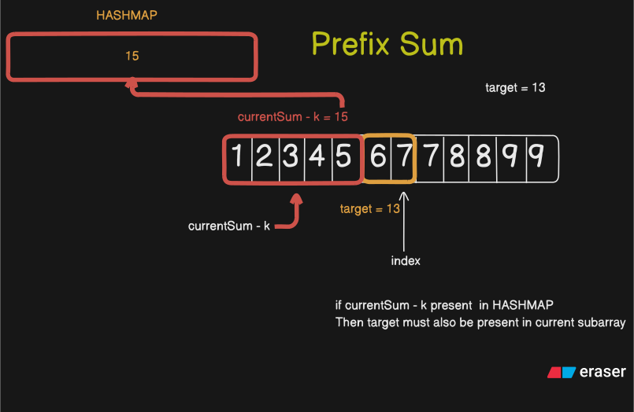
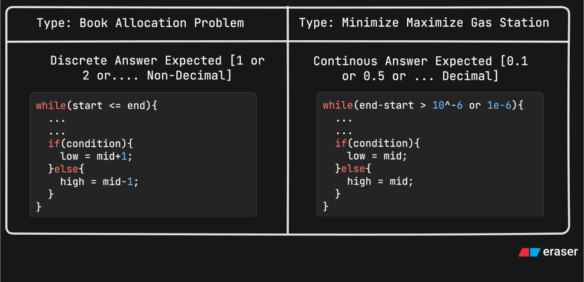
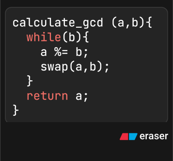

# KEYWORDS For Revise.md:

- EDGE CASE -> Cases that i missed or can miss
- FORMULA -> Formula For Particular question
- NON INTUITIVE -> No intuition almost WROTE Learning
- CONCEPT -> Makes Many Question Clear

# Custom Data Structure
Suppose we need to return for a function 
```
<int,bool,string,double>
```
the we can Make a struct
```
struct Example{
  int height;
  bool is_balanced;
  string name;
  double ans;
};

Example eg_function(){
  Example eg1 = eg_function()
  Example eg2 = eg_function()
  int new_height = eg1.height + eg2.height;
  return {new_height,eg1.is_balanced,eg2.name,eg2.ans};
}
```


# Array Declaration

- int arr[25] = {0};
- STL Sort Override
- std::sort(students.begin(), students.end(), [](const Student& a, const Student& b) {
        // For descending order, we want 'a' to come before 'b' if a.score is greater.
        return a > b;
  });


## SLIDING WINDOW
- Always if all +ve elements

# MAX HEAP OVERRIDE Custom Operator

struct CustomCompare{
  bool operator()(Node* a,Node* b){
    return a->val > b->val;
  }
}
// Think of giving priority Question HEap asks is (a,b) out of a and b; is a smaller than b if so then enter into maxHeap b
// TRUE -> Take b, FALSE Take a
// Heap Asks if a->val smaller than b->val as by default it is maxHeap expects greater first
// Eg: a=3, b=5 ; 3 > 5 -> False

# Duplicates -> _XOR_

# Subarray/Array Sum -> [PREFIX SUM] _HashMap_ => store sum or element & indexes

- Map Should Be Used For **_LONGEST_**
- 

# 2sum/3sum/4sum

- Target - arr[i] or Target - arr[i] + arr[j] or Target - arr[i] + arr[j] + arr[k] then lookup this element in stored set to get other element in O(n) => Better Appproach
- Sort Array & Search Greedily => OPtimized Approach

# [1,n] given think of calculating sum or making 2 equatins of SumN and Sum^2N and solving them

# Count Inversions/Reverse _PAIRS_ (i < j && arr[i]>arr[j]) => Merge Sort

- pairs try to use merge sort if i < j && arr[i] > arr[j] something like this condition

# Binary Search

- **_Binary Search on 1D_** Use Some Trick to Move in Either of Half (Recognize some pattern)
- **_ANSWER SPACE: _** For Finding Min/Max, Find Min Value, Max Value and apply Binary Search While looping from min <= max look if each possible otherwise go to other half
- One Limit to Another Limit Consecutive Try Apply Binary Search Eg. [minElement,maxElement] or [1,n]
- [No,No,No,Yes,Yes,Yes,Yes] -> Ans Search Space Array Looks Something like this find the min or max

## **_Binary Search [Book Allocate, Aggressive Cows, Painter Partition]_**

- greedily take sum and increase count if limit violated

## Binary Search [Decimal] Method

- 
- For First 6 Decimal Places Matching
- while(high - low > 1e-6) low = mid , high = mid

# Binary Search V/s DP

- 
- 

# Binary Search Partition

- 2 Array Given assume a partition and decide how many elements to take from smaller size array

# Maths

## LCM

- LCM = |a| \* |b| / GCD(a,b) => Avoid Integer Overflow Multiply |b| seperate
- **_GCD Formula_**
- 

## Odd/Even Trick

- Odd + Even -> Odd
- Even + Odd -> Odd
- Odd + Odd -> Even
- Even + Even -> Even

## >> , <<

- \>\> this operator divides number with 2^n [40 \>\> 2 will be 40 / 2^2]
- << this operator multiplies number with 2^n [5 << 3 will be 5 * 2^3]

## Find Ceil

- ceil( (double)arr[i] / (double) i ) // DOUBLE is Important otherwise give floor value

# REVERSAL

- Try To Use Stack If Removal of something or reversing

# Strings


## STRING STL

- .size(), .empty(), str[0], .front(), .back()
- += best for appending a string to another string
- .push_back() -> Adds Only 1 char, .insert(index,"string")
- .erase(index,length), .clear()
- str.find("any_string") != string::npos -> return index, .substr(index,len)

### string::npos is constant representing "not found" 
- to_string(42), stoi("42"), stod("4.2")

### String Extract Numbers
- ***EG: "2245 23 45 6 33"***
- From this extract numbers like 2245, 23, 45, 6 ,33
```
METHOD 1. [EASIEST BUT INTERVIEWER AVOID THIS METHOD]
#include<sstream>
string str = "2245 23 45 6 33"
stringstream stream_name(str);
int num;
while(stream_name >> num){
  cout << num;
}
```
```
METHOD 2.
string str = "2234 23 5  77 90 45";
  str+=' ';
  int curr_num = 0;
  bool building_number = false;

  for(auto &ch: str){
    if(ch == ' '){
      if(building_number){ // Avoid 0 output on Double Space
        cout<<curr_num<<"\n";
        building_number = false;
        curr_num = 0;
      }
    }else{
      curr_num = (curr_num*10) + (ch-'0');
      building_number = true;
    }
  }
```

# Linked List [Think in Edge Cases]
- Use Class for using OOPS concepts
- template can be used here
- For Insertion/Deletion at position or value Always take 2 nodes curr & prev
- DELETION delete ptr_name OR free(ptr_name) ===> Free Up The space IMPORTANT

## Fast & Slow Pointer/ Hare & Tortoise Method
- slow -> 1, fast move 2
- DETECT LOOP, FIND MIDDLE

# Heap [Priority Queue]

- When Repeatedly find max or min and array constatntly Change then use HEAP


# Stacks & Queues
## STACKS [When Use]
- LIFO(Reverse Order Processing)
- Match Open/Close Symbols
- Backtracking(DFS,Postfix)
- Simulate Recursion Call Stack,
- MONOTONIC STACK->Stack maintain same order like always increase or always decrease(Find prev/next/smaller/greater elements)[Eg: Daily Temperature, Largest Rectangle in Histogram]
- IMPORTANT:  Deal with Most Recent Info like closing Bracket

# BITMASK
## When to use BITMASK?
1. "Is N very small (<= 20)?" -> Think Bitmask DP (Toolbox #1 & #4). 
2. "Does it involve finding a unique element?" -> Think XOR (Toolbox #3).
3. "Is it about binary strings or bits?" -> Think Set/Clear/Check (The whole toolbox).
- **What 1 << k does?[0-BASED INDEXING]** 
- 1 << k create number with only K turned on eg 1<<2 creates 000100 
## 1. The "Set Bit" Operation (Turn a switch ON)
- Goal: Force the $k$-th bit to become 1.
- ```Formula: num = num | (1 << k)```  <-- This is your Gray Code formula!
- Logic:1 << k: Creates a "mask" with a single 1 at position k. (e.g., 00100)| (OR): If either bit is 1, the result is 1.
- Result: It keeps all original bits, but forces the $k$-th bit to 1.
## 2. The "Clear Bit" Operation (Turn a switch OFF)
- ~ means NOT
- Goal: Force the $k$-th bit to become 0.
- Formula: ```num = num & ~(1 << k)```
- Logic:~(1 << k): Creates a mask where position k is 0 and everything else is 1. (e.g., 11011)& (AND): Only keeps a bit if both are 1.
- Result: Since the mask has a 0 at $k$, that bit gets wiped out. The 1s elsewhere preserve the original numbers.
## 3. The "Toggle Bit" Operation (Flip a switch)
- Goal: If it's 1, make it 0. If it's 0, make it 1.
- Formula: ```num = num ^ (1 << k)```
- Logic:^ (XOR): Returns 1 if bits are different.
- Result: 1 ^ 1 = 0 (flips to off), 0 ^ 1 = 1 (flips to on).
## 4. The "Check Bit" Operation (Is the switch ON?)
- Goal: True/False check.
- Formula: ```(num & (1 << k)) != 0```
- Logic:It masks out everything except the $k$-th bit. If the result is non-zero, that bit must have been ON.

# Recursion & Backtracking
## 1. The "Binary Choice" Pattern (Pick / Not Pick)
- Used For: ```Subsets, Combinations, generating subsequences.```
- The Logic: At each step, you make a Yes/No decision for the current element.
- Handling Duplicates (Subsets II):
Sort the array first. On the "Not Pick" branch, use a while loop to skip all identical next elements.

## 2. The "Iterative Choice" Pattern (Fill the Slots)
- Used For: ```Permutations, Combinations (alternative), N-Queens, Sudoku.```
- The Logic: You have a "slot" to fill. You iterate through all available candidates to put in that slot.
- Permutations vs. Combinations:
- Permutations (Order matters): Loop i starts from 0. Use a visited array.
- Combinations (Order doesn't matter): Loop i starts from index (forward only). No visited array needed.

- Handling Duplicates (Permutations II):
Sort array. Inside the loop: if (i > 0 && nums[i] == nums[i-1] && !visited[i-1]) continue;

## 3. The "Cutting" / Partitioning Pattern
- Used For: ```Palindrome Partitioning, Word Break, Restore IP Addresses.```
- The Logic: You are holding a knife at index. You try making a cut at every possible position i after it.
- Structure:

C++
``` 
for (int i = index; i < s.length(); i++) {
    // 1. Identify the 'chunk' or 'slice'
    string chunk = s.substr(index, i - index + 1);

    // 2. Validate the chunk
    if (isValid(chunk)) {
        // 3. Recurse on the REST of the string
        // NOTE: The rest starts at 'i + 1'
        solve(i + 1);
    }
}
```

## 4. The Grid Search Pattern (DFS on Matrix)
- Used For: ```Word Search, Rat in a Maze, Number of Islands, Max Gold.```
- The Logic: Explore paths on a 2D grid.

# Trees
## BST
### 1. Insertion
- Normal Insertion just use recursion and whenever nullptr node found insert it here and return this new_node

### 2. Searching
- use recursion and whenever element found print it

### 3. Deletion
- There can be 3 cases: 0 Child [LEAF NODE], 1 Child, 2 Child
1. **0 Child:** simply delete the node
2. **1 Child:** store the left or right child then delete root node and return stored_child_node
3. **2 Child:** Find **INORDER SUCCESSOR** (Right subtree smallest element) when found update root->value with inorder_successor->value then again use recursion on right subtree with element inorder_successor->value to automatically delete the Inorder Successor as it is no longer required

### 4. Print Level Order [Queue]
- Use Queue to store root then immediately push nullptr then 
- while(!queue.empty()) repeatidly get front of queue then 
- if front == nullptr [Level Ended] then if still queue has elements then add another nullptr 
- else print front->value and add left and right child to queue if they exist

### 5. Height Tree
```
int Height(Tree* root){
  if(root == nullptr)return 0;
  int left_height = Height(root->left);
  int right_height = Height(root->right);

  return 1 + max(left_height,right_height);
}
```

- Height V/S Depth
1. Height: How far from deepest leaf node
2. Depth: How far from root

### AVL V/S Red-Black Trees
1. AVL: (Strictly Balanced) ==> At Most 1 difference between Heights of Left and Right Subtree
2. Red-Black Trees: (Roughly Balanced) ==> ensure longest path no longer than twice shortest path

### LCA 
- If 2 Nodes then deepest nodes that is parent to both nodes

### Diameter of Tree
- Longest Path between 2 Nodes

