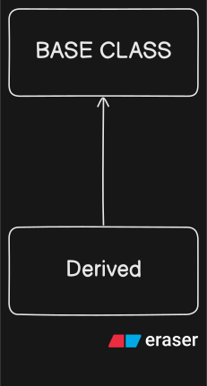
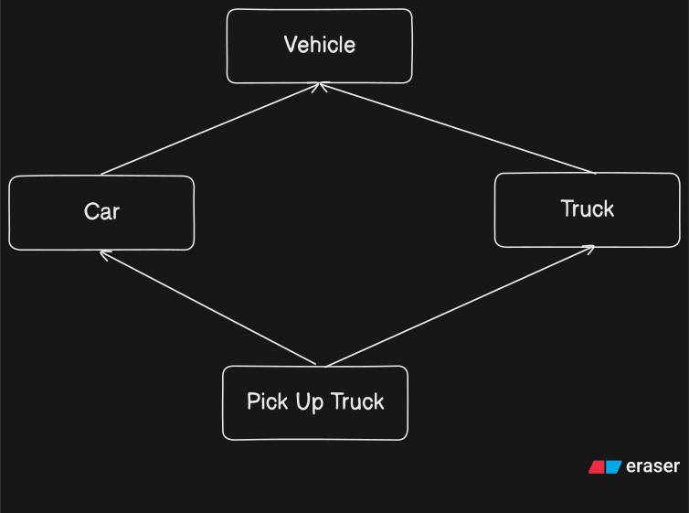
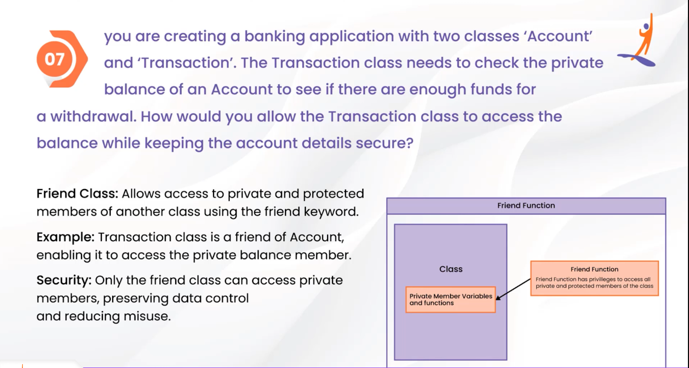
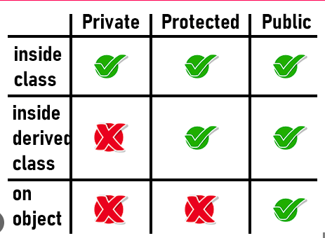
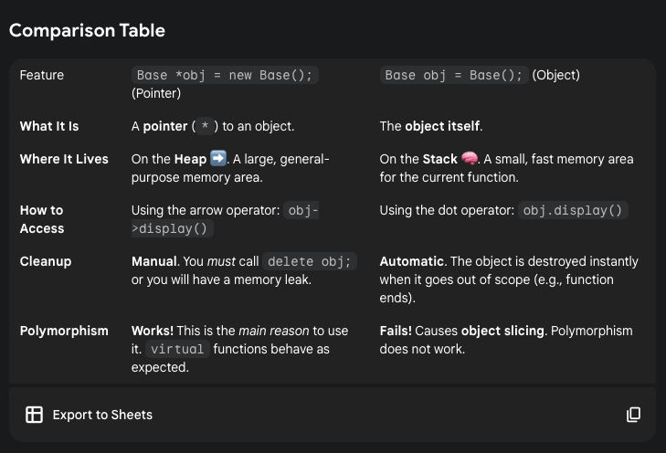

# C++ Interview

## 1. C V/S C++
### C
- Procedural {Focus On functions}
- OOPS Not Supported
- DATA ABSTRACTION: Limited To struct No class, object, polymorphism
- C Standard Library

### C++
- Multi Paradigm -> Procedural + OOPS + Generic + Functional Programming
- OOPS Supported
- DATA ABSTRACTION: classes And Access Specifiers (private, public, protected)
- C Standard Library + STL

## 2. Static Data Member
- One Copy Shared By All Objects Of a class

## 3. this Pointer (Access via -> )
- Available in Every NON-Static Member function of a class
- Stores Memory address of object invoking the function

## 4. Inline Function
- Performance Increase
- Speed up code by removing Function Call Overhead
- Direct Insertion of Code
### WHY NOT ALL Functions INLINE? 
- Large Code Definition of function can make file size bigger
- It is a suggestion/ request and compiler will ignore us if Recursive, Complex Function

## 5. Exception Handling C++
- ***\#include< stdexcept > try catch(const exception &e){cerr<<e\.what()}*** By Reference Important
- RUNTIME ERRORS(After Compilation, During Execution) -> Handle Errors Gracefully Rather than crashing
- Eg: Division By Zero
- try - catch - throw block

### Why Not All Code in try-catch block?
- Performance Overhead
- Code Clutter -> Make Code unreadable & Mixed Error Handling Logic with Core Logic
- Predicatble Errors: Like User Enter String When Number expected that should be handled Explicitly

## INHERITANCE + VIRTUAL
- 
## 6. Diamond Problem
- 
- Multiple Inheritance Diamond Problem
- Problem: Inherit Vehicle Class Twice in PickUpTruck
### SOLUTION: VIRTUAL keyword -> Enables Polymorphism & Allows Derived Class To Override Base class function [WORKS WITH POINTERS AND REFERENCES Only new Keyword or pass object as reference]

- When a function is virtual in the base class, and I call it using a pointer or reference to that base class, the program will 'ignore' the base version and call the function from the actual object it's pointing to (the 'other one').

### Vehicle* obj = new ElectricCar() <- Actual Obj
1. If engine() IS virtual in the Vehicle class: When you call v->engine(), the program sees the virtual keyword. It then checks the actual type of the object v points to (which is an ElectricCar) and calls ElectricCar::engine().

2. If engine() IS NOT virtual in the Vehicle class: When you call v->engine(), the program only looks at the pointer's type (Vehicle*) and calls Vehicle::engine(). It never checks the "right side."

- So, you are correct on both counts. The virtual keyword is the "on switch" that enables this "right-side" behavior, which is called polymorphism.

#### Example
- Your Rule Works (Pointers):

- Vehicle* v = new Car();
- v->engine(); // virtual says "ignore Vehicle, use Car" -> CORRECT

- Your Rule Fails (Objects): 
- Vehicle v = Car();
- v.engine(); // No pointer/reference. Object slicing happens.
-              The "Car" part is sliced off.
-              It calls Vehicle::engine() -> WRONG

## 7. Friend Class & Friend Function
1. Friend Class
- Allows access to private and protected members of another class using friend keyword
2. Friend Function
- Allows global or function of another class to access a class's private and protected members
- IMPORTANT: When writing in other class mention the class className; <- this declaration Above

### 

## 8. Call by Value / Call by Reference
- Call By Value -> Makes a copy of original Value
- Call By Reference -> Passes memory address, directly modify original value

## 9. Access Modifiers {private,protected,public}
- 

## 12. Polymorphism
- 
### 1. Compile Time Polymorphism
- Function OverLoading (Different Types/No. of parameters)
- Operator OverLoading (Custom Operator Behavior)

### 2. Run Time Polymorphism
- virtual Functions

Derived *d = new Base() ===> ISA Relationship Violates TYPE SAFETY because not guarantee all Derived will have Base members

## 13. Smart Pointers
- #include< memory > unique_ptr< Base > = make_unique< Base >();
- No explicit delete needed

## 14. Constructors & Types
1. Default : No Arguments, Auto Invoke
2. Parameterized: Take Arguments for initialization
3. Copy Constructor: Create a new object as copy of existing one